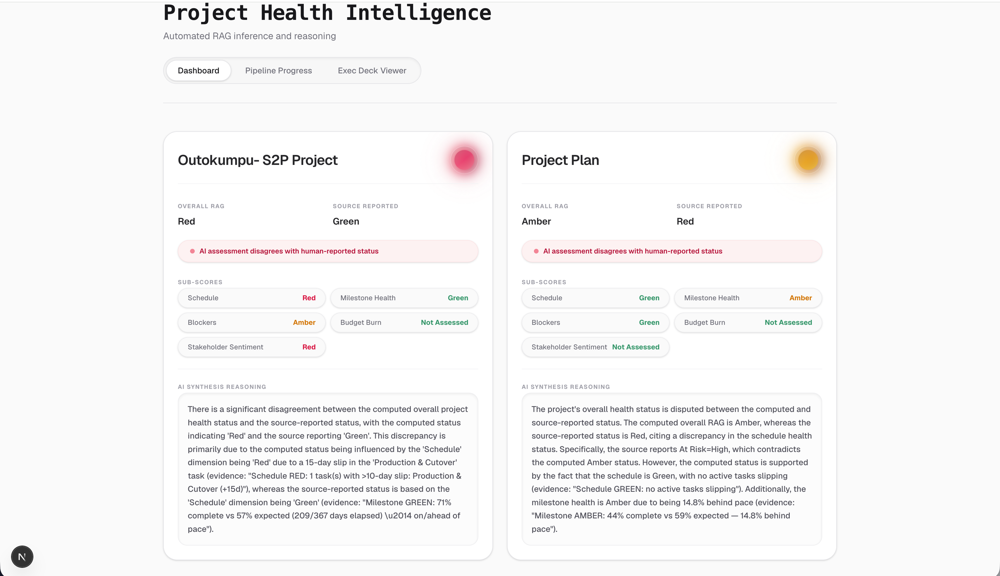
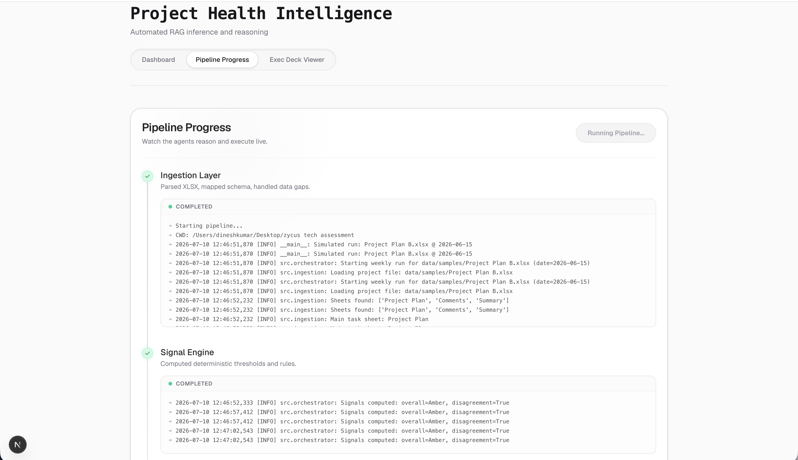
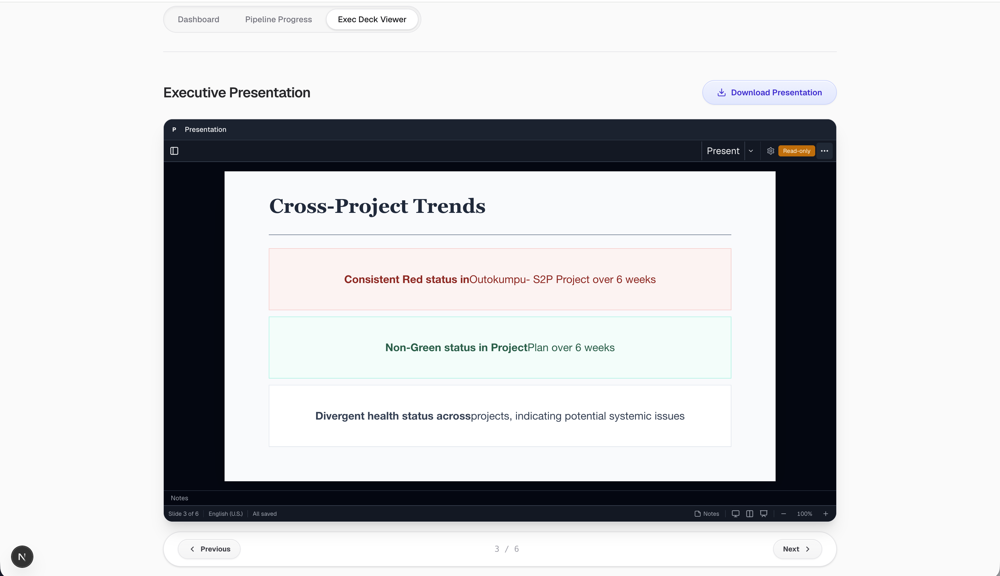
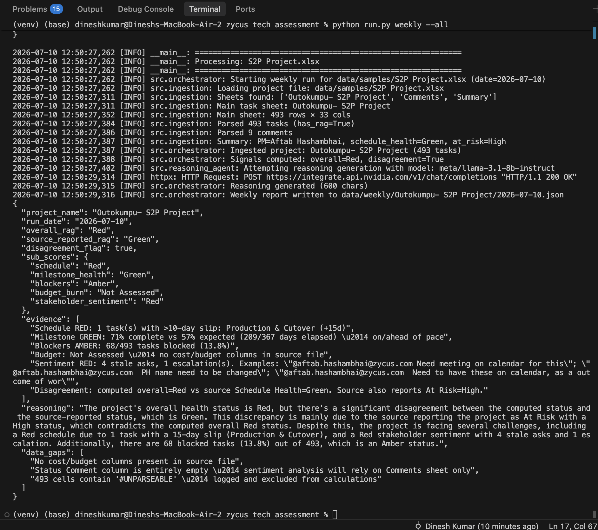
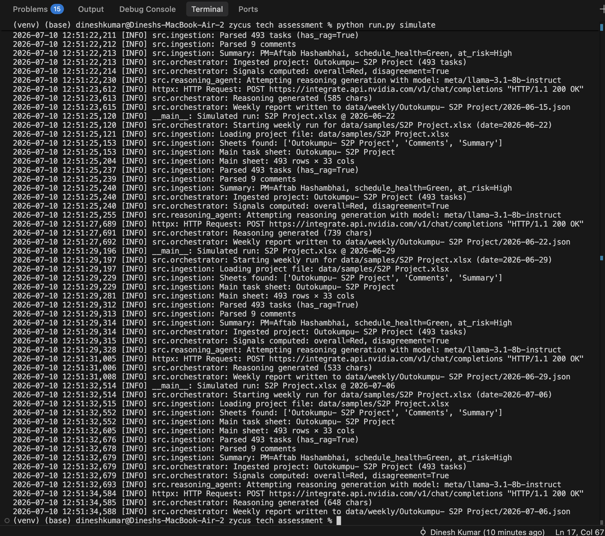
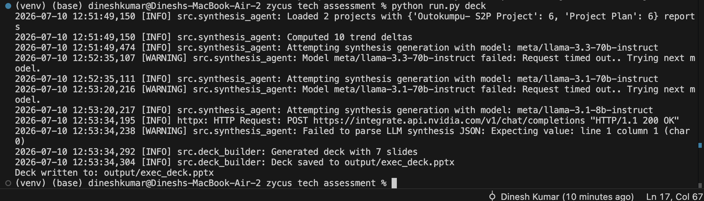
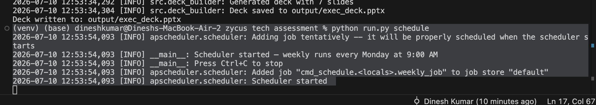
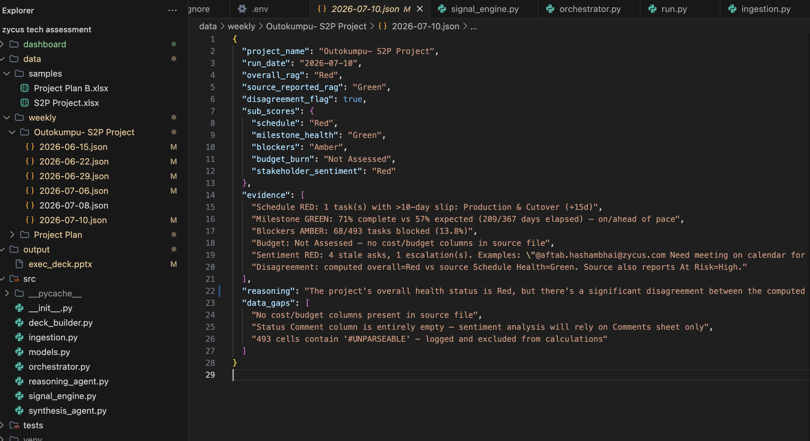
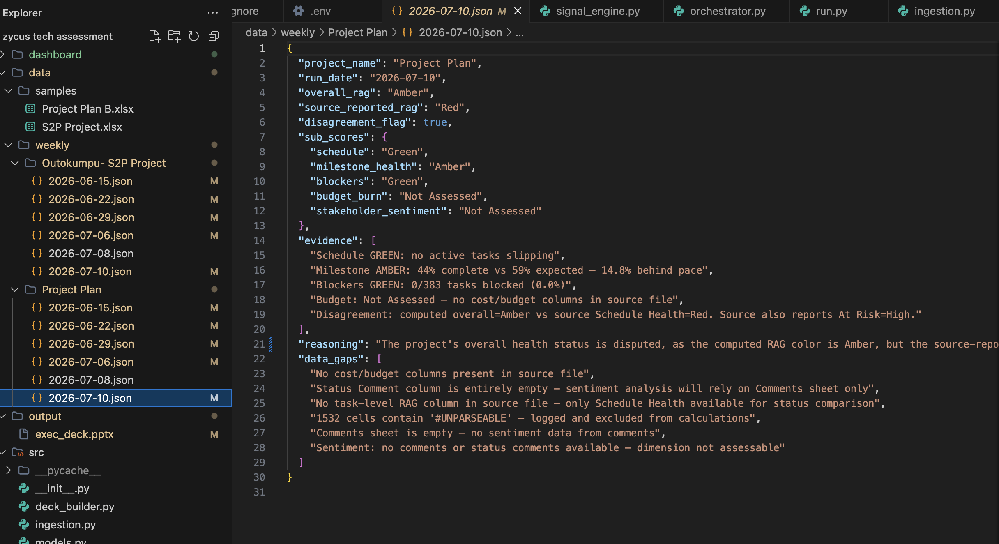
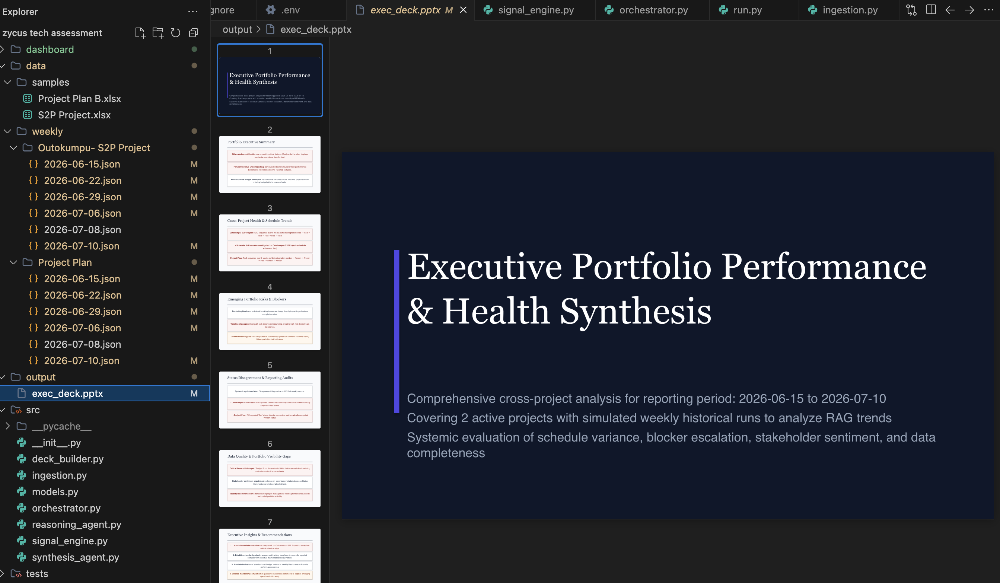

# Project Health Reporting Agent

Automates the painful part of project status reporting: reading messy project plan spreadsheets, working out an objective RAG (Red/Amber/Green) health score for each one, writing a plain-English summary with the NVIDIA NIM API, and putting it all into a PowerPoint deck you can hand to an exec.

## Screenshots

The dashboard, side by side with what the source spreadsheet reported. Both projects show the computed score disagreeing with what the PM reported.



Pipeline progress view. Each stage streams its own log as it runs, so you can watch ingestion, scoring, and reasoning happen in order instead of waiting on a spinner.



The exec deck viewer, rendering a generated slide directly in the browser.



### CLI output

Running `python run.py weekly --all` against the real sample files. You can see the Reasoning Agent call to NIM and the resulting JSON report for S2P Project, including the evidence strings that back up the Red rating.



`python run.py simulate` walking the effective date forward a week at a time to build up history for the trend synthesis.



`python run.py deck`. Worth noting here: the Synthesis Agent tried two models that timed out before falling back to a third, and even that one failed to parse as JSON, so the deck builder fell back to its non-LLM path. It still produced a 7-slide deck, which is the point of keeping the deterministic pieces separate from the LLM pieces.



And `python run.py schedule`, which starts the APScheduler job for the recurring Monday run.



### Generated output

The actual JSON report written for S2P Project, computed Red against a source-reported Green.



Same thing for Project Plan, computed Amber against a source-reported Red, the opposite direction of disagreement.



And the deck itself, opened in the editor's PowerPoint preview.



## How it's put together

I split this into 5 stages. The idea driving the split is to keep the scoring deterministic and keep the LLM out of it entirely, then bring the LLM in afterward to explain what the numbers already said. The health rating for a project is never something the model decided. It's math, and you can check it. The LLM's only job is narration.

```
xlsx file(s)
   │
   ▼
[1] Ingestion       (pandas/pydantic, no LLM)
   │  normalizes whatever sheet layout you throw at it
   ▼
[2] Signal Engine    (rule-based, no LLM)
   │  computes 5 sub-RAGs and an overall RAG, flags PM disagreement
   ▼
[3] Reasoning Agent   (1 NIM call per project)
   │  explains the score, cites specific slipped tasks
   ▼
[4] Synthesis Agent   (1 NIM call across all projects)
   │  compares projects, pulls out trends
   ▼
[5] Deck Builder      (python-pptx, no LLM)
      turns all of the above into an actual .pptx
```

### Why not just hand the sheet to an LLM

Because the sample data is genuinely contradictory. In `S2P_Project.xlsx`, the task rows say `Schedule Health: Green` but the summary tab says `At Risk: High`. Dump that into an LLM prompt and you're trusting it to notice the conflict and resolve it the same way every time, which isn't a safe bet. Instead the code computes the color straight from the raw task data, deterministically, and the LLM is only used to explain why there's a mismatch and to flag that the PM might be sugar coating the summary.

## Stack

- Python 3.11+
- pandas and openpyxl for reading the spreadsheets
- Pydantic v2 to validate the shape of the data before scoring
- NVIDIA NIM (OpenAI-compatible client, free dev tier) for the LLM parts
- python-pptx to build the deck
- APScheduler for the recurring run

No paid keys, no database, nothing that needs a cloud account beyond the free NIM tier.

## Running it

Set up a venv like normal:

```bash
python3 -m venv venv
source venv/bin/activate
pip install -r requirements.txt
```

Run it against one file, or everything in `data/samples/`:

```bash
python run.py weekly --file "data/samples/S2P Project.xlsx"
python run.py weekly --all
```

You can override the effective date too. It's mostly there so you can pretend it's a different week without waiting for one to pass.

```bash
python run.py weekly --all --effective-date 2026-06-15
```

To see the trend synthesis do something interesting, you need more than one week of history. There's a script that fakes 4 weeks of it (June 15 to July 6) by walking the date forward:

```bash
python run.py simulate
```

Once you've got weekly runs saved, build the deck:

```bash
python run.py deck
# writes to output/exec_deck.pptx
```

If you want it to run on its own every Monday, there's a built-in scheduler:

```bash
python run.py schedule
```

or skip that and use cron directly:

```bash
0 9 * * 1 cd /path/to/project && source venv/bin/activate && python run.py weekly --all
```

## NIM setup

1. Free account at [build.nvidia.com](https://build.nvidia.com)
2. Generate a key (starts with `nvapi-`)
3. `export NVIDIA_API_KEY="nvapi-your-key-here"`

If you don't set the key, it won't crash. It falls back to a plainer, template-based summary instead of the LLM-written one. Worth knowing if you're demoing this and the narrative text looks flat.

## Some decisions worth explaining

Scoring is deterministic on purpose. The rules pick the color, the LLM only writes about it. The same input always gives the same RAG rating, which matters if someone asks why a project is red six months later.

I didn't reach for LangGraph or CrewAI. Five sequential steps didn't need an orchestration framework, so I wrote a small `orchestrator.py` instead, and it's easier to read than wiring up a framework would have been.

Missing data stays missing. If a sheet doesn't have budget or comments, the code marks it `"Not Assessed"` rather than assuming Green or making something up.

The two sample files don't share a schema. S2P Project and Project Plan B use different column names for basically the same concepts, so the ingestion layer maps both into one internal shape. This was mostly to prove it wasn't hardcoded to one spreadsheet format.

There's a small Next.js dashboard too, read-only, mainly so you can trigger a run and see the deck preview without touching the CLI.

## Testing

I hand-calculated the expected scores straight from the raw spreadsheets for a few key dates and saved them as fixtures (`tests/fixtures/expected_outokumpu.json`, `expected_plan_b.json`). The Signal Engine's output gets checked against these on every run, so if a change to the scoring logic silently breaks a slip calculation, the tests catch it instead of it showing up in someone's exec deck.